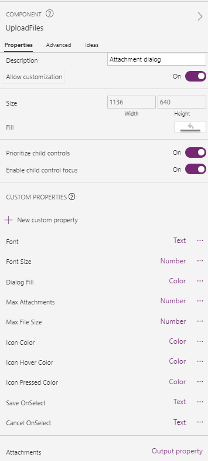

# File Uploader
> Upload files to a SharePoint Online library from a PowerApps canvas app using Power Automate Flow


### Custom Properties


### Implementation
- To show/hide the attachment dialog, add an icon or button to your application's screen and set the OnSelect property to:
```
  //Hide attachment dialog
  UpdateContext({locShowAttachmentDialog: !locShowAttachmentDialog})
```
- Set the component's Visible property to locShowAttachmentDialog
- To the Save OnSelect and Cancel OnSelect custom component properties add the statement below in order to hide the component when the corresponding icons are selected
```
  UpdateContext({locShowAttachmentDialog: false})
- To the Save OnSelect property of the component, add the following at the top. Below is what the final code should look like
```PowerFX
  ​​​​​​​ForAll(
    UploadFiles_1.Attachments,  ///Component output property containing file names and binary values
    Collect(
        colAttachControl, ///Collection containing files returned from the component
        {
            //Call to Power Automate flow
            fileInfo: YourFlowNameHere.Run(
                Name,  //File name
                //File properties
                {
                    name: Name,
                    contentBytes: Value
                },
                //Item id from related list gallery (optional)
                galContracts.Selected.ID
            )
        }
    )
);​​​​​​​
///Hide attachment dialog
UpdateContext({locShowAttachmentDialog: false})
```
